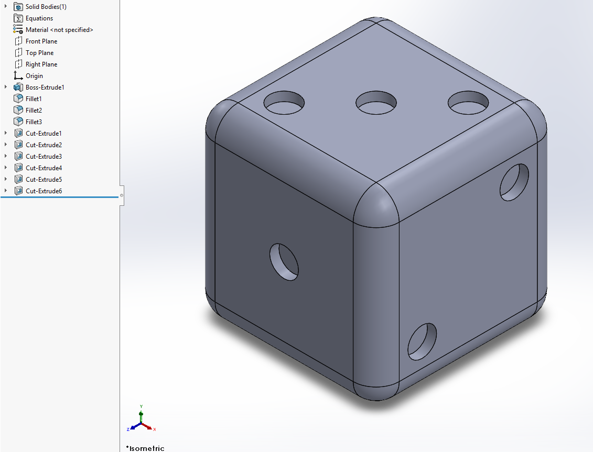

# SolidWorks MCP Server

Control SolidWorks with plain language. This [Model Context Protocol](https://modelcontextprotocol.io/) server connects AI clients such as Claude and Codex to SolidWorks, so you can describe a part — *"a 60mm mounting bracket with four M5 clearance holes and 3mm fillets"* — and watch it get built, feature by feature, in a real SolidWorks session.

This is, as far as I can tell, the most complete MCP server for SolidWorks available, and I will be expanding as time allows.

At present, the connected AI client gets **89 tools** <!-- I've had to update this like 8 times --> covering sketching, solid features, assemblies with mates, configurations, equations, and — critically — *feedback*: it can query faces and edges, check mass properties, detect interference, and take labeled screenshots of the model to see what it's actually building.

## What it can do

- **Full sketching** — lines, arcs, splines, slots, polygons, text, whole chained profiles in one call, plus driving dimensions and geometric constraints
- **Solid features** — extrude, revolve, sweep, loft, boundary; the matching cuts; fillet, chamfer, shell, draft, rib, wrap; linear/circular patterns and mirror
- **Assemblies** — insert saved parts, position them with mates (coincident, concentric, distance, angle, gears...), check interference
- **Parametrics** — named configurations, per-configuration dimensions, and equations that re-solve when driving dimensions change
- **Model awareness** — Claude can enumerate faces/edges with exact coordinates, find a face by description ("the angled face"), read mass properties against any coordinate system, and look at labeled screenshots of the model mid-build
- **State tracking** — every feature, sketch, and entity gets a stable ID, scoped per document, so multi-part + assembly sessions stay coherent

## What it can't do

- **Taste** - Claude does *not* replace design reviews, or having a sense for how things should be done.
- **Interpreting drawings** - Most AI Agents have a hard time interpreting complex or degraded drawings.

## Requirements

- **Windows** (SolidWorks only runs on Windows)
- **SolidWorks 2022 or later**, installed and activated (tested on SolidWorks 2025)
- **Claude Desktop, Codex, or the ChatGPT desktop app** (other local MCP clients may also work with manual configuration)

That's it — the installer below takes care of Python and everything else.

## Installation

### Easy install (recommended)

Open **PowerShell** (press `Win`, type "PowerShell", press Enter) and paste:

```powershell
powershell -ExecutionPolicy Bypass -c "irm https://raw.githubusercontent.com/HarrierPigeon/Solidworks-MCP-Server/main/scripts/install.ps1 | iex"
```

The script installs [uv](https://docs.astral.sh/uv/) (which provides Python — you don't need Python installed), downloads the latest release, and sets up an isolated environment under `%LOCALAPPDATA%\SolidWorksMCP`. It auto-detects Claude Desktop and Codex/ChatGPT desktop and registers the server with each confidently detected client.

To choose explicitly, download the script and run one of:

```powershell
.\install.ps1 -Client Claude
.\install.ps1 -Client Codex
.\install.ps1 -Client Both
```

Valid selections are `Auto` (the default), `Claude`, `Codex`, and `Both`. “Codex” covers the local Codex clients and ChatGPT desktop MCP configuration; it does not enable the hosted ChatGPT web app.

Then restart the configured client completely and ask it to *"create a 50mm cube in SolidWorks"*.

**To update later:** re-run the same one-liner.

**To uninstall:** delete `%LOCALAPPDATA%\SolidWorksMCP`, remove the `"solidworks"` entry from `%APPDATA%\Claude\claude_desktop_config.json` if configured, and run `codex mcp remove solidworks` if configured for Codex.

### Manual install (for developers)

Prerequisites (in addition to the requirements above):

- **[Python](https://www.python.org/downloads/) 3.10 or later** — check "Add python.exe to PATH" during install
- **[Git](https://git-scm.com/downloads/win)** (or download the repo as a ZIP from GitHub instead)

```powershell
git clone https://github.com/HarrierPigeon/Solidworks-MCP-Server.git
cd Solidworks-MCP-Server
pip install -r requirements.txt
```

(Or `pip install -e .` for an editable package install.)

> Tip: clone somewhere that isn't a network drive.

For Claude Desktop, register the server in `%APPDATA%\Claude\claude_desktop_config.json` (Claude Desktop → Settings → Developer → Edit Config):

```json
{
  "mcpServers": {
    "solidworks": {
      "command": "python",
      "args": ["C:\\path\\to\\Solidworks-MCP-Server\\server.py"]
    }
  }
}
```

For Codex and ChatGPT desktop, register it with:

```powershell
codex mcp add solidworks -- python C:\path\to\Solidworks-MCP-Server\server.py
```

Restart the configured client and you're set. (Microsoft Store installs of Claude Desktop keep its config under `%LOCALAPPDATA%\Packages\Claude...\LocalCache\Roaming\Claude` instead.)

## Try it

The die below was modeled entirely by Claude from this single prompt — and its correctness is checkable: opposite faces sum to 7, and the volume reported by mass properties matches the analytic value for a filleted cube minus 21 pips to five significant figures.

```
Make a simple dice: 16mm cube, 2mm fillets on all edges, then put the correct
pip pattern (1 through 6) on each face using shallow 2.5mm-diameter cut
circles. Opposite faces must sum to 7. Show me screenshots of three different
views when done so I can check your work.
```



More prompts to get a feel for it:

```
Create a 100mm cube in SolidWorks.
```

```
Make a bracket: 80x50x6mm base plate with a 40mm tall vertical wall along one
long edge, 5mm fillets where they meet, and four 6mm through-holes in the base.
```

```
Model a simple bolt: M10-ish — 10mm shank, 30mm long, hex head. Then show me
an isometric screenshot.
```

```
Build a two-part assembly: a plate with a 20mm hole and a 20mm pin, saved as
separate parts, then mate the pin concentric into the hole.
```

Claude works best when you give real dimensions, but it will make sensible choices if you don't. It can also read what it built (`get_faces`, `get_mass_properties`, `look_at_model`) and fix its own mistakes.

## The tools

All 89 tools are prefixed `solidworks_` (e.g. `solidworks_sketch_circle`). Dimensions are **millimeters**, angles are **degrees** — conversion to the COM API's meters/radians happens internally.

<details>
<summary><strong>Sketching (21 tools)</strong></summary>

| Tool | Description |
|---|---|
| `create_sketch` | Open a sketch on Front/Top/Right, a reference plane, or a model face (by coordinates) |
| `exit_sketch` | Close the active sketch |
| `sketch_rectangle` | Rectangle — absolute, relative-to-last-shape, spacing, or corner-defined positioning |
| `sketch_circle` | Circle — absolute or relative positioning |
| `sketch_profile` | Whole chained profile (lines / tangent arcs / arcs) in one call, optional auto-close + corner fillets |
| `sketch_line` / `sketch_centerline` | Line segments; centerlines double as revolve/mirror axes |
| `sketch_arc` | Arc — 3-point or center-point |
| `sketch_spline` | Spline through points |
| `sketch_ellipse` | Ellipse with optional rotation |
| `sketch_polygon` | Regular polygon (inscribed/circumscribed) |
| `sketch_slot` | Straight slot from two centers + width |
| `sketch_point` / `sketch_text` | Reference points and sketch text |
| `sketch_fillet` | Round a sketch corner with an exact tangent arc |
| `sketch_offset` | Offset existing geometry (chains supported) — hollow profiles, wall thickness |
| `sketch_dimension` | Add a driving dimension (length/radius/between), optionally setting the value |
| `set_dimension_value` | Change an existing dimension |
| `sketch_constraint` | Geometric relations: horizontal, vertical, coincident, tangent, equal, ... |
| `sketch_toggle_construction` | Toggle construction geometry |
| `get_last_shape_info` | Center/edges/size of the last drawn shape (for relative positioning) |

</details>

<details>
<summary><strong>Modeling (11 tools)</strong></summary>

| Tool | Description |
|---|---|
| `new_part` | New blank part document |
| `create_extrusion` | Extrude the sketch (BLIND or THROUGH_ALL; `merge:false` for multi-body work) |
| `create_cut_extrusion` | Cut-extrude (auto-flips direction into the body when needed) |
| `combine_bodies` | Boolean ADD / SUBTRACT / COMMON on a multi-body part |
| `set_material` | Assign a SOLIDWORKS material (needed for real mass numbers) |
| `set_parameter` | Set any dimension by name (`D1@Boss-Extrude1`) — parametric edits |
| `list_parameters` | Every driving dimension with its addressable name, value, and owning feature |
| `suppress_feature` / `delete_feature` | Suppress or remove features |
| `get_mass_properties` | Mass, volume, surface area, center of mass (optionally vs. a coordinate system) |
| `list_features` | The feature tree |

</details>

<details>
<summary><strong>Features — boss & cut (8 tools)</strong></summary>

| Tool | Description |
|---|---|
| `revolve` / `cut_revolve` | Revolve the sketch about its centerline |
| `sweep` / `cut_sweep` | Sweep a profile sketch along a path sketch |
| `loft` / `cut_loft` | Loft between 2+ profiles on different planes |
| `boundary_boss` / `boundary_cut` | Boundary features with optional guide curves |

</details>

<details>
<summary><strong>Applied features (7 tools)</strong></summary>

| Tool | Description |
|---|---|
| `fillet` | Round edges — pick by coordinates or fillet every edge of a named feature |
| `chamfer` | Bevel edges (distance, angle, or two-distance) — by coordinates or every edge of a named feature |
| `shell` | Hollow the part, removing chosen faces |
| `draft` | Draft faces against a neutral plane |
| `rib` | Rib from an open sketch profile |
| `wrap` | Emboss / deboss / scribe a sketch onto a face |
| `intersect` | Keep the common volume of overlapping bodies |

</details>

<details>
<summary><strong>Patterns & holes (5 tools)</strong></summary>

| Tool | Description |
|---|---|
| `linear_pattern` | 1- or 2-direction linear pattern — direction by model axis (`X`/`Y`/`Z`) or edge point |
| `circular_pattern` | Pattern around an axis |
| `mirror` | Mirror features across a plane or planar face |
| `hole_wizard` | Hole Wizard holes (counterbore/countersink/tapped) — see caveat in Troubleshooting |
| `thread` | Cosmetic thread on a circular edge |

</details>

<details>
<summary><strong>Reference geometry (4 tools)</strong></summary>

| Tool | Description |
|---|---|
| `ref_plane` | Offset / angled / through-point reference planes |
| `ref_axis` | Axis from two points, a cylindrical face, or an edge |
| `ref_point` | Point at coordinates, arc center, face center, or on an edge |
| `coordinate_system` | Coordinate system at an origin with optional axis edges |

</details>

<details>
<summary><strong>Seeing the model (10 tools)</strong></summary>

| Tool | Description |
|---|---|
| `get_body_info` | Bounding box + face/edge/vertex counts |
| `get_faces` | Every face: type, area, normal, sample point, and the feature that created it |
| `get_edges` | Every edge: type, endpoints, midpoint, length, adjacent features — filter by type or feature |
| `get_face_edges` | One face (by coordinate) and its bounding edges |
| `get_vertices` | All vertex coordinates |
| `find_face` | Select a face by *description*: orientation, creating feature, surface type, area rank |
| `look_at_model` | Screenshot returned straight into the conversation, with face labels matching `get_faces` |
| `get_state` | Tracked session state + live model context (bounding box, sketch status, config, docs) |
| `get_entity` / `get_sketch_entities` | Drill into any tracked object or sketch |

</details>

<details>
<summary><strong>Documents & assemblies (15 tools)</strong></summary>

| Tool | Description |
|---|---|
| `save_document` | True Save As (bare filenames land in `workspace/`) |
| `open_document` / `activate_document` / `close_document` / `list_documents` | Multi-document sessions |
| `capture_views` | Export standard-view PNGs (isometric, front, top, ...) to disk |
| `new_assembly` | New assembly document |
| `insert_component` | Insert a saved part (first component is auto-fixed) |
| `add_mate` | COINCIDENT, CONCENTRIC, PARALLEL, PERPENDICULAR, TANGENT, DISTANCE, ANGLE, LOCK, GEAR |
| `edit_mate` | Change a distance/angle mate and get updated positions |
| `check_interference` | Overlap volumes + the components involved |
| `suppress_component` / `list_components` / `list_mates` | Assembly management |
| `get_assembly_mass_properties` | Assembly mass properties |

</details>

<details>
<summary><strong>Configurations & equations (7 tools)</strong></summary>

| Tool | Description |
|---|---|
| `add_configuration` / `switch_configuration` / `list_configurations` | Named design variants |
| `set_config_parameter` | Set a dimension in one configuration only |
| `add_equation` / `list_equations` / `delete_equation` | Dimension equations that re-solve automatically |

</details>

<details>
<summary><strong>Batching (1 tool)</strong></summary>

| Tool | Description |
|---|---|
| `batch` | Run up to 25 independent tool calls in a single request (tested for multi-entity sketching) |

</details>

## How it works

```
Claude  →  MCP tool call  →  server.py dispatch  →  solidworks/ module  →  SolidWorks COM API
```

- The server connects to a running SolidWorks instance (or launches one) via COM (`pywin32`).
- Every created object gets a **stable ID** (`feat:Boss-Extrude1`, `sketch:Sketch1`, `comp:bracket-1`) tracked per document, so Claude can refer back to things it built — even across multiple parts and an assembly in one session.
- Tools return structured JSON, and geometry-query tools return coordinates that can be fed directly into selection-based tools (fillet this edge, sketch on that face).

## Troubleshooting

**Claude says it can't connect to SolidWorks**
- Make sure SolidWorks is installed and activated; launching SolidWorks *before* Claude Desktop is the most reliable order.
- If SolidWorks runs elevated, run Claude Desktop as Administrator too (COM won't cross the elevation boundary).

**The server doesn't show up in Claude Desktop**
- Restart Claude Desktop fully: File → Exit (not just closing the window), then reopen.
- Check the config file for JSON typos: `%APPDATA%\Claude\claude_desktop_config.json` (Microsoft Store installs: `%LOCALAPPDATA%\Packages\Claude...\LocalCache\Roaming\Claude\`).

**"No Part template found"**
- Templates are auto-discovered at `C:\ProgramData\SOLIDWORKS\SOLIDWORKS <year>\templates\`. If yours live elsewhere, adjust the glob in `solidworks/connection.py`.

**Hole Wizard hangs or errors**
- `hole_wizard` can trigger a blocking SolidWorks dialog on some setups. The reliable fallback is a sketched circle + cut-extrude, which Claude will use if you ask.

**Anything else**
- Check `solidworks_mcp.log` next to `server.py` (easy install: `%LOCALAPPDATA%\SolidWorksMCP\app\`), then [open an issue](https://github.com/HarrierPigeon/Solidworks-MCP-Server/issues) with the relevant lines.

## Development

```powershell
python test.py            # full test suite (needs a live SolidWorks)
python test.py --list     # list tests; --category / --test / --gui to filter
python dev_server.py      # hot-reload dev server (pip install watchdog)
python clean.py           # close all open SolidWorks documents
```

There is no mock of the COM layer — tests drive a real SolidWorks instance. `tests/agent_capability_tests.md` additionally contains 46 copy-paste prompts for end-to-end testing through Claude itself. Architecture notes live in [CLAUDE.md](CLAUDE.md).

Contributions welcome — please open an issue or PR.

## Known limitations

- Drawing (2D drafting) generation isn't implemented yet.
- `hole_wizard` may trigger a blocking dialog (see Troubleshooting).
- WIDTH mates aren't implemented; component positioning is mate-driven (direct transform setting isn't available via late-bound COM).
- no PDM / PDM Pro or 3DExperience (Enovia) awareness.  If you have extra PDM Pro licenses, or access to the Enovia API docs, please reach out!

## License

[MIT](LICENSE)

---

**Disclaimer:** *This project is not affiliated with or endorsed by Dassault Systèmes SolidWorks Corporation. "SolidWorks" is a registered trademark of Dassault Systèmes. Generated geometry should be reviewed before usage.  May cause happiness or induce wonder.  If your session lasts longer than 3 hours consider drinking water and adjusting your chair.*
